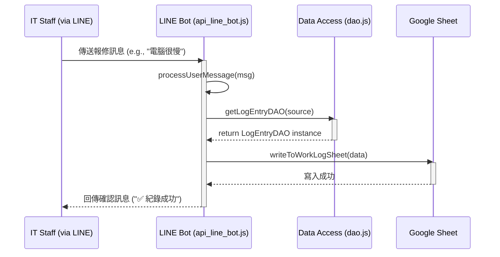
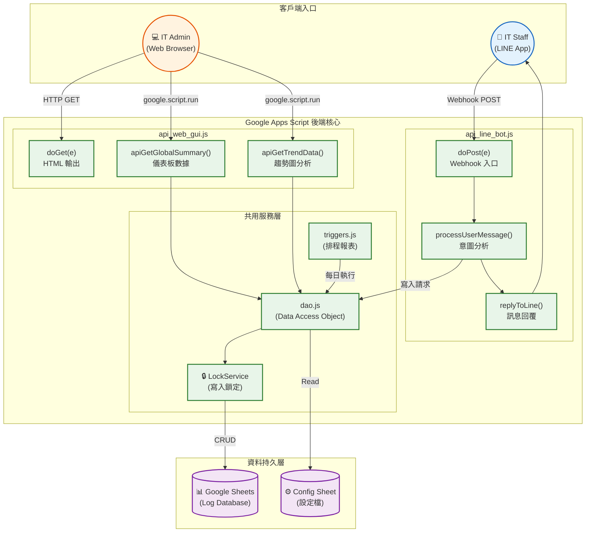

# gas-ops-hub

gas-ops-hub 是一套為單人或小型 IT 團隊打造的維運記錄系統，基於 Google Apps Script 開發，不需要伺服器、不需要額外付費，用你現有的 Google 帳號就能跑起來。

整合工單管理、日報自動化、LINE Bot 即時登打與 Web GUI 儀表板。從 2025 年 8 月起在真實飯店環境持續運行，累積超過六個月的實際使用驗證。

專為低人數 IT 部門設計——兼顧日常維運、突發報修與日報產出自動化。

---

## 1. 核心使用者場景 (User Stories)

在深入技術細節之前，我們先定義系統的核心使用場景，這有助於理解系統設計的初衷。

### 核心場景：IT 人員的日常 Log 紀錄與管理

本系統的使用者 **預設為 IT / MIS 人員**。系統提供了兩種互補的操作介面，以適應不同的工作情境。

-   **使用者**:  IT / MIS 人員。
-   **觸發點**:
    1.  **即時紀錄 (via LINE Bot)**: IT 人員在處理臨時性任務或巡檢時，需要快速記錄工作 Log。
    2.  **綜合管理 (via Web GUI)**: IT 人員需要一個集中的平台來查看、處理、更新所有案件，並進行數據分析。

-   **工作流程**:
    1.  **快速紀錄**: IT 人員透過手機 LINE App，將工作摘要（如 "機房巡檢完成"、"更換三樓交換器"）傳送給指定的 LINE Bot。系統會將此訊息快速存入對應的 Google Sheet。
    2.  **詳細管理**: IT 人員在辦公室時，打開系統的 Web GUI 網頁。
    3.  網頁會讀取所有 Google Sheet 中的紀錄，並以功能完整的列表呈現。
    4.  IT 人員可以透過介面進行詳細操作：
        -   **更新案件狀態**: 例如從「待處理」改為「處理中」或「已完成」。
        -   **補充處理進度**: 註記詳細的處理過程與結果。
        -   **新增案件**: 手動建立新的工作項目或需求。
    5.  所有變更都會即時回寫到 Google Spreadsheet。
    6.  系統提供分析圖表，讓 IT 主管能快速掌握案件處理的趨勢與統計數據。

---

## 2. 資料處理流程 (Data Processing Flow)

本章節說明一筆 Log 從使用者輸入到最終儲存的完整生命週期。



上圖展示了最核心的資料寫入流程：

1.  **接收**: `api_line_bot.js` 中的 `doPost` 函式作為 Webhook 接收來自 LINE 平台的訊息。
2.  **解析**: `processUserMessage` 函式解析訊息內容，判斷其類型（報修、日報、需求）。
3.  **鎖定目標**: `writeToWorkLogSheet` 函式會先讀取設定，找到對應類型的 Log 應該被寫入哪一個 Google Sheet 檔案的哪一個工作表。
4.  **取得 DAO**: 透過 `getLogEntryDAO(source)` 取得一個專門負責與該目標工作表溝通的資料存取物件 (DAO)。
5.  **寫入**: DAO 物件執行寫入操作，將資料新增至 Google Sheet 的新一列或一個空的儲存格。此過程包含 `LockService`，確保在高併發下資料寫入的安全性。
6.  **回饋**: 寫入成功後，系統回傳確認訊息給使用者。

---

## 3. 系統工作流 (System Workflow)

本章節描述系統中主要的兩個入口 (LINE Bot, Web GUI) 如何觸發後端服務，以及各模組之間的協作方式。

```mermaid
graph TD
    subgraph "User Interfaces"
        A[IT Staff (LINE Bot)]
        B[IT Staff via Browser]
    end

    subgraph "GAS Web App (Backend Services)"
        C[api_line_bot.js]
        D[api_web_gui.js]
        E[main.js / dao.js]
        F[triggers.js]
        G[report_v2.js / analytics.js]
    end

    subgraph "Data Storage"
        H[Google Sheets]
    end

    subgraph "External Services"
        I[LINE Messaging API]
        J[Gmail API]
        K[Google Charts]
    end

    A -- "Sends message" --> I -- "Webhook" --> C
    B -- "HTTPS Request" --> D

    C -- "Writes Log" --> E
    D -- "Reads/Writes Log" --> E
    D -- "Generates Reports" --> G

    E -- "CRUD Operations" --> H

    F -- "Time-based trigger" --> J
    G -- "Creates Chart" --> K
    C -- "Replies" --> I
```

系統主要由兩個入口點驅動：

1.  **LINE Bot (`api_line_bot.js`)**:
    -   **職責**: 處理來自 LINE 使用者的傳入訊息。
    -   **互動**: 這是系統的「寫入」主要入口。它接收文字訊息，調用核心邏輯 (`main.js`, `dao.js`) 將資料寫入 Google Sheets。它也透過 LINE API 回傳訊息給使用者。

2.  **Web GUI (`api_web_gui.js`)**:
    -   **職責**: 提供給 IT 人員一個豐富的圖形化管理介面。
    -   **互動**: 這是系統的「讀取、寫入、分析」核心入口。前端頁面 (`index.html`) 會呼叫此檔案中定義的各種 `api*` 函式，以實現讀取紀錄、更新進度、新增任務、以及產生分析圖表等功能。

共用的核心服務：
-   **`dao.js`**: 資料存取層，所有對 Google Sheets 的讀寫操作都應透過此模組，以確保邏輯的統一與可維護性。
-   **`main.js`**: 包含讀取設定檔等共用函式，是各模組都會依賴的工具集。
-   **`triggers.js`**: 包含由時間驅動的觸發器，例如每日自動寄送報表的 `dailyJob`，它會獨立運行，讀取資料並透過 `mail.js` 寄送郵件。
-   **`report_v2.js`**: 負責產生 Google **文件** 格式的每日日報。
-   **`analytics.js`**: 負責將指定區間的數據，產生為獨立的 Google **試算表** 統計檔案。

---

## 4. 函式相依性 (Function Dependencies)

本章節梳理核心程式碼檔案的職責，以及主要函式之間的呼叫關係。

本系統的程式碼遵循模組化的設計，將不同職責的邏輯分散到不同的 `.js` 檔案中。所有檔案最終都會被 Google Apps Script (GAS) 平台整合在同一個執行環境下，因此函式可以跨檔案互相呼叫。

### 檔案職責概覽

-   **`api_line_bot.js`**: **LINE Bot Webhook 入口**
    -   `doPost(e)`: 接收 LINE 傳來的 HTTP POST 請求，是所有 Bot 訊息的起點。
    -   `processUserMessage(...)`: 核心邏輯控制器，判斷使用者訊息意圖，並分派到不同處理路徑。
    -   `writeToWorkLogSheet(...)`: 專門處理來自 Bot 的資料寫入邏輯，包含併發鎖定 (`LockService`)。
    -   `replyToLine(...)`: 透過 LINE Messaging API 回傳訊息給使用者。

-   **`api_web_gui.js`**: **Web GUI 後端 API**
    -   `doGet(e)`: 提供 Web App 的 HTML 介面 (`index.html`)。
    -   `apiGetSheetData(...)`: 提供指定工作表的資料給前端。
    -   `apiCreateTask(...)`, `apiUpdateTask(...)`: 處理來自前端的新增與更新請求。
    -   `apiGetGlobalSummary(...)`, `apiGetAnalysisData(...)`: 提供儀表板與動態分析圖表所需的彙總數據。
    -   `fetchStatsDataNative(...)`: 從 Google Sheets 撈取並彙總原始數據，供儀表板圖表使用。

-   **`dao.js`**: **資料存取物件 (Data Access Object)**
    -   `BaseDAO`, `ConfigDAO`, `LogEntryDAO`, `CategoryDAO`: 提供一個抽象層，封裝了所有對 Google Sheets 的底層操作 (e.g., `SpreadsheetApp.openById`, `getSheetByName`)。所有其他模組都應透過 DAO 來存取資料，而非直接操作 `SpreadsheetApp`。
    -   `getLogEntryDAO(source)`: 工廠函式，根據傳入的 `source` 設定，動態建立對應的 DAO 實例。

-   **`main.js`**: **共用設定與工具函式**
    -   `readConfig()`: 從設定檔工作表讀取所有啟用的資料來源 (Spreadsheets)，是系統啟動時獲取設定的核心函式。
    -   `readMailSettings()`: 讀取郵件寄送設定。
    -   `formatDateValue(...)`, `parseEmails(...)`: 各種工具函式。

-   **`triggers.js`**: **自動化觸發器**
    -   `dailyJob()`: 每日定時觸發，負責產生並寄送 IT 日報。
    -   此檔案中的函式通常由 GAS 的觸發器管理介面進行設定，而非由程式碼直接呼叫。

-   **`report_v2.js`**: **文件報表模組**
    -   `generateReport()`: 讀取各資料來源，並使用 Google Doc 範本產生每日日報文件。
-   **`analytics.js`**: **獨立統計報表模組**
    -   `export...Stats(...)`: 根據指定條件（如月份、季度），將數據彙總並建立一份全新的 Google Sheet 統計報表檔案。

### 核心呼叫鏈範例 (LINE Bot 寫入流程)

```
1. api_line_bot.js: doPost(e)
     |
     └─> processUserMessage(msg, token, userId)
           |
           └─> writeToWorkLogSheet(data, ...)
                 |
                 ├─> main.js: readConfig()
                 |     |
                 |     └─> dao.js: getMainConfigDAO().readSourceList()
                 |
                 └─> dao.js: getLogEntryDAO(source).getSheet()
                       |
                       └─> (SpreadsheetApp API calls)
```

### 核心呼叫鏈範例 (Web GUI 讀取流程)

```
1. (Frontend JS makes an API call) -> api_web_gui.js: apiGetSheetData(sheetId, sheetName)
     |
     └─> dao.js: getLogEntryDAO(source).getSheet()
           |
           └─> (SpreadsheetApp API calls to get data)
```

---

## 5. 系統上限分析 (Quota Analysis)

本章節基於 Google Apps Script (GAS) 的服務配額，分析本系統在每日使用上的理論極限值。

Google Apps Script (GAS) 在免費的 consumer a ccount (@gmail.com) 和付費的 Google Workspace 帳號下，有不同的服務配額 (Quotas)。此分析以常見的 **Google Workspace Business** 帳號為基準，其配額通常更高。

### 主要分析的配額項目

| 服務 (Service) | 操作 (Operation) | Workspace Business 配額/天 | 系統中的主要應用 |
| :--- | :--- | :--- | :--- |
| **Spreadsheet** | `SpreadsheetApp.openById` | - (無明確限制) | `dao.js` 中每次存取不同 Sheet |
| | `getRange`, `setValue`, `getValues` | 30,000 read/writes / min | 所有資料的讀寫操作 |
| **Triggers** | Total runtime | 6 hours / day | `triggers.js` 中的每日報表 |
| **URL Fetch** | `UrlFetchApp.fetch` calls | 100,000 / day | `api_line_bot.js` 回覆訊息給 LINE |
| **LockService** | `lock.waitLock()` | 30 seconds / attempt | `api_line_bot.js` 寫入時的併發控制 |

### 理論上限計算

我們分析兩個最頻繁的操作：**LINE Bot 訊息寫入** 和 **Web GUI 頁面讀取**。

#### 1. LINE Bot 訊息寫入 (單次操作)

一次成功的 LINE Bot 訊息處理，會觸發以下 API 呼叫：

1.  `PropertiesService.getScriptProperties()`: 讀取白名單 (極低消耗)。
2.  `readConfig()` -> `SpreadsheetApp.openById` & `getRange`: **~2 次 Sheet Read** (讀取設定檔)。
3.  `getLogEntryDAO()` -> `SpreadsheetApp.openById`: **1 次 Sheet Open** (開啟目標 Log Sheet)。
4.  `sheet.getRange`, `sheet.setValue`: **~5-10 次 Sheet Read/Write** (讀取表頭、寫入各欄位)。
5.  `UrlFetchApp.fetch`: **1 次 URL Fetch** (回覆 LINE 訊息)。
6.  `LockService.waitLock`: **~10 秒** (最長等待時間)。

-   **瓶頸分析**:
    -   **單次執行時間**: 寫入操作通常在 1-3 秒內完成，遠低於 GAS 單次執行 6 分鐘的上限。`LockService` 的 10 秒等待是為了處理同時湧入的多筆訊息，是必要的保護機制。
    -   **每日總量**: 主要限制來自 `UrlFetchApp.fetch` 的 100,000 次/天。理論上，系統一天最多可接收並回覆 **100,000** 則 LINE 訊息。然而，更現實的瓶頸會是試算表的讀寫速度與 GAS 的總執行時間。

#### 2. Web GUI 儀表板讀取 (單次操作)

一次完整的儀表板頁面載入 (`apiGetGlobalSummary`)，會觸發以下操作：

1.  `readConfig()`: **~2 次 Sheet Read**。
2.  `forEach(source)` 迴圈:
    -   假設有 3 個資料來源 (e.g., 報修、日報、需求)。
    -   `getLogEntryDAO()`: **3 次 Sheet Open**。
    -   `sheet.getRange`: **3 次 Sheet Read** (讀取所有資料)。

-   **瓶頸分析**:
    -   **執行時間**: 這是系統中最耗時的操作。如果每個 Sheet 有數千筆資料，一次 `getValues()` 可能需要 5-10 秒。若有 3 個 Sheets，總執行時間可能達到 15-30 秒。這也是為什麼 `api_web_gui.js` 中加入了 `CacheService` 快取機制，避免每次刷新都重新計算。
    -   **每日總量**: 此操作不涉及外部 API 呼叫，主要限制是 GAS 的總執行時間 (6 小時/天)。假設每次完整讀取需要 20 秒，則一天理論上可承受：
        -   `6 (小時) * 3600 (秒) / 20 (秒/次) = 1080 次`
        -   理論上，每日可承受約 **1,080** 次的「儀表板快取刷新」。由於快取的存在 (例如設定 15 分鐘過期)，實際的使用者頁面瀏覽次數可以遠高於此數值。

### 結論

-   **寫入能力**: 系統的寫入能力非常強，理論上限由 LINE 的 API 呼叫次數決定，每日可達數萬次，遠超一般企業內部使用所需。
-   **讀取與分析能力**: 系統的讀取效能是主要瓶頸，特別是在資料量增大時。目前的程式碼透過 **伺服器端快取 (`CacheService`)** 和 **限制讀取筆數 (`LIMIT = 2000`)** 等策略來緩解此問題。
-   **優化建議**: 若未來資料量持續增長，導致儀表板讀取過慢，應考慮將資料從 Google Sheets 遷移至更專業的資料庫 (如 Google Cloud SQL)，並透過 JDBC Service 進行連接，以獲得更佳的讀寫效能。

---

## 6. 環境配置與部署 (Environment & Deployment)

本專案使用 [Google Apps Script CLI (clasp)](https://github.com/google/clasp) 進行開發與部署。請遵循以下步驟進行環境設定。

### 6.1. 前置要求

1.  **Node.js**: 請確保您的開發環境已安裝 Node.js (建議版本 v14 或以上)。
2.  **啟用 Google Apps Script API**:
    *   前往 [Google Apps Script API 設定頁面](https://script.google.com/home/usersettings)。
    *   確保 "Google Apps Script API" 的選項是開啟 (On) 的。

### 6.2. 安裝與設定

1.  **安裝 clasp**:
    ```bash
    npm install -g @google/clasp
    ```

2.  **登入 Google 帳號**:
    ```bash
    clasp login
    ```
    此指令會打開瀏覽器，請登入您要用來部署此專案的 Google 帳號，並授予 clasp 權限。

3.  **複製專案**:
    *   在本地端，使用 `clasp clone <scriptId>` 來複製一個已存在的專案。
    *   如果是首次建立，請使用 `clasp create --title "IT Logbook System" --rootDir ./src` 來建立新專案，並將 `src` 目錄設為來源碼根目錄。

### 6.3. 部署流程

本專案的部署流程非常單純。當您在本地端的 `src/` 目錄下完成程式碼修改後，執行以下指令即可將程式碼推送到 Google Apps Script 平台。

```bash
clasp push
```

推送成功後，您需要手動在 Apps Script 編輯器中進行以下操作：

1.  **建立新版本**: 前往 "部署" > "管理部署作業"，選擇您的 Web App 部署，點擊 "編輯" 圖示，並在 "版本" 欄位選擇 "新增版本"。
2.  **更新 Web App**: 儲存新版本後，您的 Web App 就會更新為最新的程式碼。

---

## 7. 設定檔結構 (Config Structure)

本系統將所有環境相關的設定值儲存在 **指令碼屬性 (Script Properties)** 中，以避免將機敏資訊 (如 API 金鑰、試算表 ID) 硬編碼在程式碼裡。`src/config.js` 檔案提供了統一的介面 (`CONFIG.get(key)`) 來讀取這些設定。

### 7.1. 設定方式

絕大部分的 ScriptProperties 由系統在 **onboarding 初始化流程**中自動建立，
無需手動到 GAS 後台填寫。

唯一需要在 setup 頁面主動填寫的項目為：
- `LINE_CHANNEL_ACCESS_TOKEN`：若使用 LINE Bot 功能則填入
- `GEMINI_API_KEY`：若使用 Gemini 自然語言處理功能則填入（選填）

若需要手動檢視或修改 ScriptProperties，請至 GAS 後台 >「專案設定」>「指令碼屬性」。

### 7.2. 核心屬性列表

| 屬性名稱 | 用途 | 寫入時機 |
| :--- | :--- | :--- |
| `MAIN_CONFIG_SPREADSHEET_ID` | Config 試算表 ID | 系統初始化時自動寫入 |
| `REPORTS_FOLDER_ID` | 2_Reports 資料夾 ID | 系統初始化時自動寫入 |
| `NEEDS_FOLDER_ID` | 3_Analytics 資料夾 ID | 系統初始化時自動寫入 |
| `COMPARISON_FOLDER_ID` | 3_Analytics 資料夾 ID（與 NEEDS_FOLDER_ID 目前指向同一資料夾） | 系統初始化時自動寫入 |
| `DATA_SOURCES_FOLDER_ID` | 1_DataSources 資料夾 ID | 系統初始化時自動寫入 |
| `WEB_APP_URL` | 部署後的 Web App URL | 首次存取時自動寫入 |
| `REPORT_TEMPLATE_ID` | 每日日報 Google Doc 範本 ID | 系統初始化時自動建立並寫入 |
| `LINE_CHANNEL_ACCESS_TOKEN` | LINE Bot Channel Access Token | setup 頁面填寫後寫入 |
| `GEMINI_API_KEY` | Gemini AI API 金鑰（選填） | setup 頁面填寫後寫入 |
| `LINE_ALLOWED_USERS` | LINE Bot 白名單 User ID，逗號分隔。對 Bot 傳訊後從 GAS 執行紀錄取得 User ID，再手動至 GAS 後台「指令碼屬性」填入。後續版本將提供 UI 管理介面 | 手動寫入 |

> **注意：** Email 相關設定（收件人、副本、寄件者名稱）不儲存於 ScriptProperties，
> 請直接在 Config 試算表的 **Email** 工作表填寫。

### 7.3. 安全性設計

#### URL 即憑證
gas-ops-hub 部署為 GAS Web App 後，任何擁有 Web App URL 的人都可以存取系統介面。
這是 GAS 平台的架構限制，系統本身沒有帳號登入機制。

**建議做法：**
- 將 Web App URL 視為機敏資訊，僅分享給需要使用的 IT 人員
- 不要將 URL 張貼在公開頻道或文件中

#### Setup Guard
`apiProvisionAndSetup()` 與 `apiSetupProject()` 兩個初始化函式內建保護機制：
系統啟動時會檢查 `MAIN_CONFIG_SPREADSHEET_ID` 是否已存在，
若已存在則直接拒絕執行，防止誤操作或惡意重置覆蓋現有設定。

#### 金鑰傳輸安全
`LINE_CHANNEL_ACCESS_TOKEN` 與 `GEMINI_API_KEY` 透過 `google.script.run` 傳輸，
全程走 HTTPS，無中間人攻擊風險。
金鑰寫入 ScriptProperties 後，前端介面無法讀回，不會外洩。

### 7.4. 危險操作

#### ⚠️ 重設系統

若需要重設系統並重新初始化，請依序執行以下步驟：

1. 前往 [Google Apps Script 後台](https://script.google.com)，開啟本專案
2. 點擊左側「專案設定」（⚙️）
3. 在「指令碼屬性」區塊找到 `MAIN_CONFIG_SPREADSHEET_ID`，將其刪除
4. 重新開啟 Web App URL，若頁面未更新請強制重新整理（Windows: `Ctrl+F5` / Mac: `Cmd+Shift+R`），系統會回到初始化設定畫面

**重設前請注意：**
- 此步驟僅刪除 `MAIN_CONFIG_SPREADSHEET_ID` 以解除初始化鎖定，
  其餘設定（如 LINE Token、Gemini Key）會保留，重新初始化後可直接沿用。
  若需要完整清除所有設定，請至「指令碼屬性」手動逐一刪除所有 key
- 刪除 `MAIN_CONFIG_SPREADSHEET_ID` 只會解除系統與 Config 試算表的綁定，
  **不會刪除** Google Drive 上的任何資料夾或試算表
- 若要完整清除，請手動至 Google Drive 刪除 `gas-ops-hub-project` 資料夾
- 重新初始化後會建立全新的 Config 試算表與資料夾結構，
  舊的資料來源需重新在 Config 試算表登記

---

## 8. API 規格 (API Specification)

本系統提供兩種主要的 API 入口：一個給 LINE Bot，另一個給 Web GUI。

### 8.1. LINE Bot Webhook (`api_line_bot.js`)

-   **Endpoint**: `doPost(e)`
-   **觸發方式**: 當使用者傳送訊息給 LINE Bot 時，LINE Platform 會發送一個 HTTP POST 請求到 GAS Web App 的 URL。
-   **請求結構 (Request Body)**:
    ```json
    {
      "events": [
        {
          "type": "message",
          "replyToken": "...",
          "source": { "userId": "U123abc...", "type": "user" },
          "message": { "type": "text", "text": "使用者輸入的訊息" }
        }
      ]
    }
    ```
-   **核心處理邏輯**:
    1.  `doPost` 函式解析請求，並將事件傳遞給 `processUserMessage`。
    2.  `processUserMessage` 函式會：
        *   驗證 `userId` 是否在白名單內 (`LINE_ALLOWED_USERS`)。
        *   根據訊息內容（例如 "儀表板", "日報", "需求"）進行路由 (Routing)。
        *   呼叫 `writeToWorkLogSheet` 將資料寫入對應的 Google Sheet。
        *   呼叫 `replyToLine` 將處理結果回傳給使用者。

### 8.2. Web GUI API (`api_web_gui.js`)

前端 `index.html` 透過 `google.script.run` 來呼叫以下後端函式。所有函式都由 `api_web_gui.js` 提供。

| 函式名稱 | 用途 | 參數 | 回傳值 |
| :--- | :--- | :--- | :--- |
| `apiGetSources()` | 取得所有設定檔中定義的資料來源 (Sheets)。 | `()` | `Array<Object>`: 資料來源物件陣列。 |
| `apiGetFormOptions()` | 取得表單所需的下拉選單選項，如部門、報修項目等。 | `()` | `Object`: 包含 `depts`, `repairItems`, `needsItems` 陣列。 |
| `apiGetAdminMenu()` | 取得管理員選單的設定。 | `()` | `Array<Object>`: 選單設定物件。 |
| `apiRunAdminJob(payload, jobType)` | 執行管理員指定的後端任務。 | `payload: any`, `jobType: string` | `any`: 任務執行結果。 |
| `apiGetSheetData(sheetId, sheetName)` | 讀取指定 Google Sheet 的資料，並格式化為 Log 列表。 | `sheetId: string`, `sheetName: string` | `Object`: 包含 `data` (Log 陣列) 和 `meta` (元資料)。 |
| `apiGetGlobalSummary()` | 取得儀表板所需的 KPI、今日事件流、待處理項目等彙總數據。 | `()` | `Object`: 包含 `kpi`, `stream`, `pending` 的物件。 |
| `apiCreateTask(payload)` | 從 Web GUI 新增一筆 Log 紀錄。 | `payload: Object` (包含 `sourceName`, `data`) | `Object`: `{ success: boolean, message: string }` |
| `apiUpdateTask(payload)` | 更新一筆既有的 Log 紀錄 (通常是更新狀態或進度)。 | `payload: Object` (包含 `uuid`, `sourceName`, `updates`) | `Object`: `{ success: boolean, message: string }` |
| `apiGetAnalysisData(payload)` | 根據指定的類型與區間，產生動態分析圖表所需的數據。 | `payload: Object` (包含 `type`, `period`) | `Object`: Chart.js 格式的圖表數據。 |
| `apiGetTrendData(dateRange)` | 取得指定日期區間內的案件趨勢數據 (新增、完成、待處理)。 | `dateRange: Object` (包含 `startDate`, `endDate`) | `Object`: Chart.js 格式的趨勢圖數據。 |

---

## 9. 錯誤處理與除錯指南 (Error Handling & Debugging)

### 9.1. 錯誤處理機制

系統在主要的 API 入口點 (`doPost`, `api*` 函式) 都使用了 `try...catch` 區塊來捕獲執行期間的錯誤。

-   **`api_line_bot.js`**:
    -   `doPost` 和 `processUserMessage` 中的 `catch` 區塊會捕捉到錯誤。
    -   錯誤訊息會透過 `Logger.log()` 記錄到 Google Apps Script 的日誌中。
    -   系統會嘗試回傳一則錯誤訊息給 LINE 使用者，例如 `⚠️ 系統錯誤：[錯誤訊息]`。
-   **`api_web_gui.js`**:
    -   所有 `api*` 函式中的 `catch` 區塊會捕捉到錯誤。
    -   錯誤會被 `throw new Error(...)` 的方式傳遞回前端。
    -   前端的 JavaScript 程式碼會接收到這個錯誤，並在 UI 上顯示一個錯誤通知。
    -   同時，錯誤也會被 `Logger.log()` 記錄下來。

### 9.2. 除錯指南

當系統行為不如預期時，開發者可以利用以下工具進行除錯：

1.  **Apps Script 執行紀錄 (Executions)**:
    *   在 Apps Script 編輯器中，點擊左側的 "執行" (Executions) 圖示 (▶️)。
    *   這裡會列出每一次函式被觸發的紀錄 (不論是 Webhook 或是使用者從 GUI 操作)。
    *   您可以查看每個執行的 **開始時間**、**持續時間** 與 **狀態** (成功/失敗)。
    *   對於失敗的執行，點擊進去可以查看詳細的 **錯誤訊息** 與 **堆疊追蹤 (Stack Trace)**，這對於定位問題非常有幫助。

2.  **Apps Script 日誌 (Logger)**:
    *   在 "執行紀錄" 的詳細視圖中，您可以看到由 `Logger.log()` 所產生的所有日誌。
    *   本系統在關鍵步驟（如 `doPost` 收到請求、`catch` 到錯誤）都有安插日誌，您可以透過過濾日誌內容來追蹤程式的執行流程。

3.  **直接在函式中除錯**:
    *   您可以在 Apps Script 編輯器中，手動選擇一個函式 (例如 `test()`) 並點擊 "執行"。
    *   在該函式中使用 `Logger.log()` 印出變數值，執行後即可在日誌中查看，這是在不觸發 Webhook 的情況下測試特定邏輯的好方法。

---

## 系統架構圖 (System Architecture Diagram)


