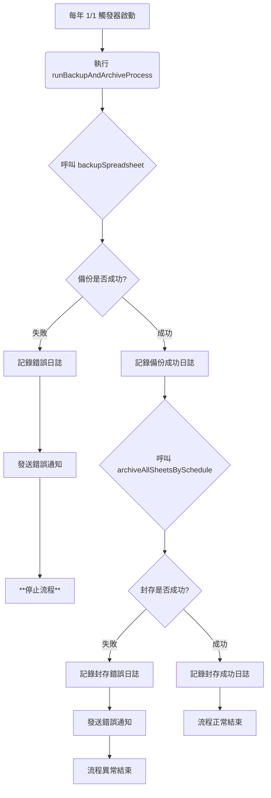

# 規格書：整合式定時備份與封存機制

## 1. 總覽

本文件旨在規劃一個整合式的自動化流程，該流程將在執行年度資料封存之前，自動對整個 Google Spreadsheet 檔案進行一次完整的快照備份。此機制的目的是確保在封存（一種破壞性操作）過程中，若發生任何預期外的錯誤，皆有可供還原的時間點備份，最大化保障資料的安全性與可逆性。

## 2. 核心流程

此流程由一個年度觸發器啟動，依序執行兩個核心步驟：

1.  **完整備份 (Backup)：** 複製當前的 Spreadsheet 檔案至一個指定的備份資料夾。
2.  **資料封存 (Archive)：** **僅在備份成功後**，才執行原有的年度資料封存邏輯。

## 3. 組態設定 (手動設定)

為了提高系統彈性並遵循 GAS 最佳實踐，備份目的地資料夾的 ID 將儲存在「指令碼屬性 (Script Properties)」中，而非硬編碼在程式碼裡。

*   **屬性名稱 (Key):** `BACKUP_FOLDER_ID`
*   **設定方式:**
    1.  使用者需手動在 Google Drive 建立一個資料夾 (建議名稱: `Logbook Backups`)。
    2.  取得該資料夾的 ID (可從資料夾網址中取得)。
    3.  在 Apps Script 編輯器中，前往 `專案設定 > 指令碼屬性`，新增此鍵值對。

## 4. 檔案與函數規劃

### 4.1. `src/triggers.js` - 觸發器與主控流程

此檔案將包含啟動整個流程的觸發器，以及協調備份與封存順序的主控制器。

#### `createYearlyArchiveTrigger()` - (修改)
*   **職責：** 建立或更新一個每年一月初執行的觸發器。
*   **修改點：** 此觸發器現在應指向新的主控函數 `runBackupAndArchiveProcess`，而非直接指向封存函數。

#### `runBackupAndArchiveProcess()` - (新增)
*   **職責：** 作為整個備份與封存流程的進入點與總控制器。
*   **執行邏輯：**
    1.  寫入執行日誌，標示「年度備份與封存流程已啟動」。
    2.  呼叫 `Maintenance.backupSpreadsheet()` 函數，並等待其完成。
    3.  **錯誤處理：** 使用 `try...catch` 區塊包覆備份操作。若 `backupSpreadsheet()` 拋出錯誤：
        *   立即記錄詳細錯誤日誌。
        *   發送錯誤通知郵件給管理員。
        *   **中止後續所有操作**，不執行封存。
    4.  若備份成功，記錄成功日誌。
    5.  接續呼叫 `Maintenance.archiveAllSheetsBySchedule()` 執行資料封存。
    6.  寫入最終完成日誌。

### 4.2. `src/maintenance.js` - 核心維護功能

此檔案將包含備份與封存的核心商業邏輯。

#### `backupSpreadsheet()` - (新增)
*   **職責：** 執行單次的 Spreadsheet 完整備份。
*   **執行邏輯：**
    1.  使用 `PropertiesService.getScriptProperties().getProperty('BACKUP_FOLDER_ID')` 取得目標資料夾 ID。
    2.  **驗證：** 檢查該 ID 是否存在且有效。若否，拋出一個明確的錯誤 (`throw new Error('Backup Folder ID not found or invalid.')`)。
    3.  取得當前的 Spreadsheet ID (`SpreadsheetApp.getActiveSpreadsheet().getId()`)。
    4.  使用 `DriveApp.getFileById(spreadsheetId)` 取得檔案物件。
    5.  使用 `DriveApp.getFolderById(backupFolderId)` 取得目的地資料夾物件。
    6.  執行 `file.makeCopy(destinationFolder)` 進行複製。
    7.  產生帶有時間戳的檔案名稱，格式為 `[備份]YYYY-MM-DD_logbook_data`。
    8.  使用 `copiedFile.setName(newFileName)` 將新建立的副本重新命名。
    9.  返回複製成功的檔案物件以供主流程確認。

## 5. 執行流程可視化 (Mermaid Diagram)

## 6. 結論

此規劃將備份作為封存的前置安全鎖，透過將變數外部化至指令碼屬性、明確的職責劃分以及穩健的錯誤處理機制，建立了一個更安全、更具維護性的自動化維運流程。
