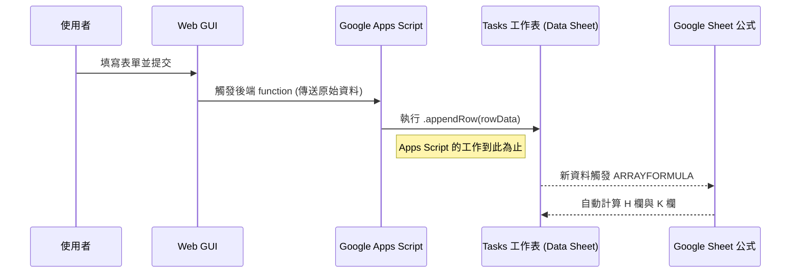

# GasOpsHub-Data 最終架構規劃

## 1. 總覽

本文件定義 `GasOpsHub-Data` Google Sheet 的最終範本結構。此規劃是實作的唯一依據，旨在建立一個精簡、高效且易於維護的資料後端。核心原則是將所有計算邏輯（如：部門對應、報修分類）全部交由 Google Sheet 的原生公式處理，Apps Script 的職責僅限於將 Web GUI 提交的原始資料附加 (append) 到 `Tasks` 工作表。

## 2. 試算表結構

`GasOpsHub-Data` 試算表包含以下兩個工作表：

### 2.1. `Tasks` 工作表 (The Single Source of Truth)

- **用途**：存放所有由 Web GUI 寫入的原始紀錄，作為系統唯一的真實來源。
- **系統責任**：
    1.  **自動建立**：首次執行時，系統將自動偵測並建立此工作表。
    2.  **寫入表頭**：系統會將指定的表頭寫入第一列 (Row 1)。
    3.  **注入公式**：系統會將以下三個核心 `ARRAYFORMULA` 公式直接寫入對應的表頭儲存格，使其自動應用於整欄：
        -   `A1`: `="更新"`
        -   `H1`: `="部門(自動)"`
        -   `K1`: `="報修分類(自動)"`
    4.  **資料寫入**：當使用者從 Web GUI 新增資料時，Apps Script 僅負責將使用者填寫的欄位（如 `狀態`, `項目`, `處理進度簡述` 等）附加到此工作表的最後一列。Apps Script **不**會進行任何計算。

### 2.2. `參數對照檔` 工作表

-   **用途**：作為 `Tasks` 工作表中 `XLOOKUP` 公式的資料來源，集中管理所有參數，如部門、報修分類等。
-   **系統責任**：
    1.  **自動建立**：首次執行時，系統將自動偵測並建立此工作表。
    2.  **注入整合式 `IMPORTRANGE` 公式**：為了應對 `Config` 試算表中可能存在的多個參數工作表（例如 `部門對照`、`分類對照`），系統將在 `A1` 儲存格自動填入一個**整合式公式**。
        -   **公式範例**:
            ```excel
            =QUERY({
              IMPORTRANGE("CONFIG_SHEET_ID", "'部門工作表'!A:B");
              IMPORTRANGE("CONFIG_SHEET_ID", "'分類工作表'!A:B")
            }, "SELECT * WHERE Col1 IS NOT NULL")
            ```
        -   **完全自動化，無需手動對應**: 系統的設計目標是**零手動對應**。使用者無需在程式碼或 `Data` 試算表中進行任何手動設定。所有參數來源的對應關係，將集中在 `Config` 試算表中進行管理。
        -   **動態組合 (由 `_source_sheets` 主控)**: `installer.js` 的自動化流程如下：
            1.  **讀取主控表**: 在 `Config` 試算表中，會規定一個名為 `_source_sheets` 的**主控工作表**。此工作表將包含所有要導入的參數來源清單，格式如下：

| SheetName | Range | IsEnabled |
| :--- | :--- | :--- |
| 部門對照 | A:B | TRUE |
| 分類對照 | A:C | TRUE |
| 人員列表 | A:B | FALSE |

            2.  **動態生成公式**: `installer.js` 會讀取 `_source_sheets` 中 `IsEnabled` 為 `TRUE` 的所有列。
            3.  根據讀取到的 `SheetName` 和 `Range`，動態地生成 `IMPORTRANGE` 語句，並用陣列語法 `{...;...}` 將它們組合起來。
            4.  **注入公式**: 最後，將組合好的 `QUERY({...})` 公式注入到 `Data` 試算表的 `參數對照檔` 工作表的 `A1` 儲存格。
        -   **優點**: 此設計將對應關係的管理**完全交給了使用者**，使用者只需在 `_source_sheets` 這個簡單的表格中增刪或啟用/停用參數來源，即可完全控制 `Data` 試算表的內容，整個過程**無需接觸任何程式碼**，實現了真正的使用者友好與高度彈性。

## 3. 資料流 (Data Flow)



-   **寫入流程**：
    1.  使用者透過 Web GUI 提交新紀錄。
    2.  Apps Script 後端接收到資料。
    3.  Apps Script 將收到的原始資料直接附加到 `Tasks` 工作表的最後一列。**僅此一步**。
-   **計算流程**：
    1.  所有自動計算（更新、部門、分類）完全由寫在表頭的 `ARRAYFORMULA` 和 `XLOOKUP` 公式在 Google Sheet 內部自行處理。
    2.  Apps Script **完全不介入**任何資料的計算或轉換。

## 4. 顧問式挑戰與確認

-   **需求本質重述**：您期望建立一個極度簡化的資料庫，將所有運算負擔從 Apps Script 轉移到 Google Sheet 本身，讓 GAS 只做最單純的「資料寫入」工作。
-   **顧問式挑戰**：此架構高度依賴 `IMPORTRANGE` 的穩定性。在極端情況下，若來源 `Config` 試算表權限變更或網路延遲，`參數對照檔` 的更新可能會有延遲，進而影響 `Tasks` 工作表中 `XLOOKUP` 的即時性。這是一個可接受的權衡，因為它換來了極大的架構簡化與維護便利性。
-   **替代方案**：另一個選項是由 Apps Script 在後端直接讀取 `Config` 的值，然後在寫入 `Tasks` 表時一併寫入計算好的值。**但這違背了我們「讓 GAS 保持簡單」的核心原則**，會增加指令碼的複雜度和耦合性，因此**不建議**採納。目前的規劃是最佳實踐。

請確認以上規劃是否符合您的最終需求。若無誤，請回覆「Go/可以」，我們將立即進入實作階段。

---

## 5. 風險評估與應對策略 (根據回饋修訂)

### 5.1. `IMPORTRANGE` 的「授權牆」問題

-   **風險**: `IMPORTRANGE` 首次在兩個試算表之間使用時，Google 會出於安全考量，要求使用者**手動**點擊儲存格中的「允許存取」按鈕。這是一個無法透過 Apps Script 程式碼自動繞過的限制。
-   **應對策略**:
    1.  **明確文件化**: 在 `README.md` 和部署文件中，將「手動授權 `IMPORTRANGE`」列為一個**必要的、一次性的部署後手動步驟**。
    2.  **安裝程序提示**: 在 `installer.js` 的執行日誌中，明確提示使用者需要去 `參數對照檔` 工作表的 `A1` 儲存格手動點擊授權。

### 5.2. 資料治理：防止「公式自殺」

-   **風險**: `ARRAYFORMULA` 公式存放在表頭（第一列）。若使用者不慎手動編輯了該列的任何儲存格，可能會破壞公式，導致整欄計算失效。
-   **應對策略**:
    1.  **工作表保護**: 系統在自動建立 `Tasks` 工作表後，將**自動使用 Apps Script 將第一列（Row 1）設定為「受保護區域」**，僅限試算表擁有者可以編輯。
    2.  **公式備份**: 在 `Config` 試算表中，將會有一份核心 `ARRAYFORMULA` 的文字備份。這提供了一個簡單的手動還原機制，以防萬一保護被意外解除且公式被破壞。

### 5.3. 效能治理 (`XLOOKUP`)

-   **風險**: 當 `Tasks` 工作表的資料量增長到數千筆時，大量的 `XLOOKUP` 計算可能降低試算表的反應速度。
-   **應對策略**:
    1.  **維持輕量化**: 架構本身就是為了應對此問題而設計。將計算交給高度優化的 Google Sheet 引擎通常比 Apps Script 迴圈更有效率。
    2.  **查詢限制**: Web GUI 在讀取資料時，應維持 `LIMIT = 2000` 或類似的查詢筆數限制，避免一次性載入過多資料導致前端緩慢，確保使用者介面體驗流暢。這是在應用層的限制，與資料庫層的計算無直接衝突，但能有效管理效能。

### 5.4. 公式注入的穩固性

-   **風險**: 如果僅僅寫入公式本身，表頭文字可能會被使用者意外修改。
-   **應對策略**:
    1.  **陣列式寫法**: 在 `installer.js` 中，將採用**陣列式語法**注入公式，將表頭文字與 `ARRAYFORMULA` 綁定在一個單元格內。
    2.  **範例**: `= {"部門(自動)"; ARRAYFORMULA(IF(ISBLANK(B2:B),, XLOOKUP(...)))}`
    3.  **優點**: 這種寫法確保了表頭與其對應的計算邏輯成為一個不可分割的原子單元，大幅提高了架構的穩固性。